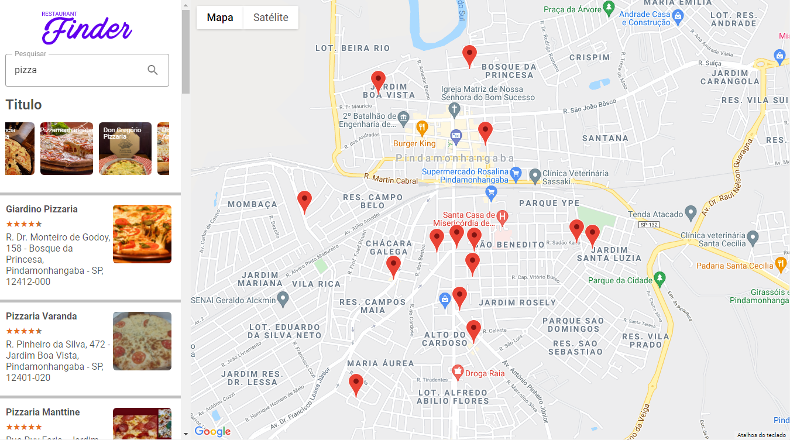

    
 

Projeto realizado no Bootcamp de React do Digital Inovation One

<a href="restaurants-search-dun.vercel.app">Restaurant Finder</a>

  

## Sobre o projeto

Projeto executado durante o Bootcamp de React da LocalizaLabs, pelo Digital Inovation One, utilizando ReactJs e as APIS Places e Maps da Google Cloud Plataform.

## Tecnologias e bibliotecas utilizadas

- ReactJS
- Styled Components
- Maps e Places API (Google Cloud Plataform)
- React Redux
- Skeleton e react-lottie
- React-slick/slick-carousel
- React-rating-stars-component

